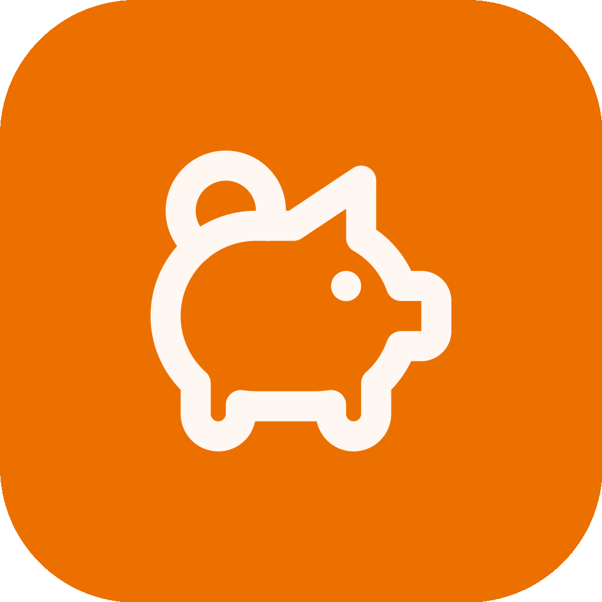
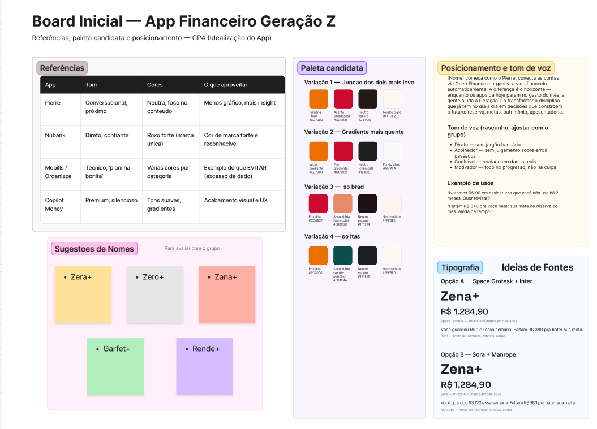
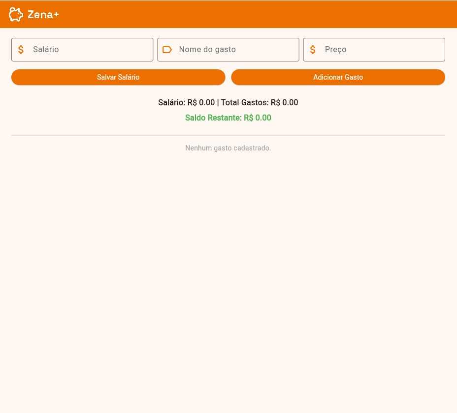

# Zena+ — Documentação Inicial

## Proposta de valor

Zena+ começa como o Pierre (CloudWalk): conecta a vida financeira do usuário e organiza tudo automaticamente, sem planilha e sem exigir que a pessoa vire "analista financeira de si mesma". A diferença é o horizonte — enquanto os apps de hoje param no controle do gasto do mês, o Zena+ ajuda a Geração Z a transformar a disciplina que ela já tem no dia a dia em decisões que constroem o futuro: reserva, metas, patrimônio, aposentadoria.

## O problema

Dados recentes mostram um contraste importante na nossa geração:

- Segundo o **Mapa da Inadimplência do Serasa (maio/2026)**, jovens de 18 a 25 anos representam apenas **11% dos inadimplentes do país**, a menor participação entre todas as faixas etárias (contra 33,3% na faixa 26-40 e 35,7% na faixa 41-60).
- Segundo o estudo **Raio X do Investidor Brasileiro 2026** (Anbima + Datafolha), apenas **12% da Geração Z** já iniciou uma reserva para aposentadoria, embora **66%** afirmem que pretendem começar no futuro.
- Um levantamento do setor (ClienteSA) aponta que **55%** da Geração Z se considera financeiramente organizada, o maior índice entre as gerações, mas **73%** sente que suas conquistas financeiras estão atrasadas em relação às próprias metas, e **42%** diz que o dinheiro afeta diretamente a saúde mental.

Ou seja: somos a geração mais disciplinada no controle do dia a dia, mas sem estrutura nenhuma para pensar em longo prazo, e isso já pesa na cabeça de quem vive essa realidade.

## Público-alvo

- Jovens de aproximadamente **18 a 25 anos**, majoritariamente universitários ou em início de carreira
- Já usam banco digital e Pix no dia a dia, alguns têm cartão de crédito e pagam em dia
- Nunca fizeram um investimento de longo prazo ou não sabem por onde começar
- Querem organização sem esforço manual (não gostam de planilha, não têm paciência pra apps cheios de gráfico)
- Valorizam marcas com linguagem direta e que não os tratem como "irresponsáveis"

## Funcionalidades

O protótipo atual já roda com o fluxo básico de controle financeiro manual:
- Cadastro de salário
- Cadastro de gastos (nome + preço)
- Cálculo automático de saldo restante (Salário − Total de Gastos)
- Listagem dos gastos cadastrados

## Visão de longo prazo (Roadmap)

A partir dessa base manual, o plano é evoluir para o que o Zena+ se propõe a ser:
1. **Conexão via Open Finance** — importar contas e cartões automaticamente (simulado com dados mockados no CP5)
2. **Categorização automática de gastos** — sem precisar classificar manualmente cada transação
3. **Alertas inteligentes** — ex.: assinaturas esquecidas, gasto fora do padrão do mês
4. **Metas de reserva/objetivo de longo prazo** — viagem, entrada de imóvel, aposentadoria
5. **Simulação "eu no futuro"** — projeção de patrimônio com base no hábito atual

> Este roadmap será revisado a cada Checkpoint conforme o grupo decide o que entra no MVP funcional do CP5/CP6.

## Marca

- **Nome:** Zena+ mantém o "Z" como referência direta à Geração Z, e o "+" reforça a proposta central da marca: depois de organizar o básico, sempre tem um próximo passo (guardar, investir, crescer). O nome soa como um nome próprio curto, no mesmo espírito humanizado da concorrencia, o que facilita a construção de um tom de voz mais pessoal e menos corporativo.
- **Tom de voz:** direto, acolhedor, confiável, motivador (sem julgamento sobre erros passados)
- Exemplos de uso:
  - "Notamos R$ 90 em assinaturas que você não usa há 2 meses. Quer revisar?"
  - "Faltam R$ 340 pra você bater sua meta de reserva do mês. Ainda dá tempo."

## Identidade visual

- **Paleta:** laranja Itaú (`#EC7000`) como cor primária + vermelho Bradesco (`#CC092F`) como acento, com neutros quentes (`#241A15` / `#FFF7F2`)
- **Tipografia:** Space Grotesk (títulos e números em destaque) + Inter (interface, tabelas, corpo) — ambas gratuitas via Google Fonts / pacote `google_fonts` no Flutter
- **Logo:** ícone de porquinho (cofrinho) + wordmark "Zena+", arquivos finais:
  - `zena-logo-dark-bg.png` (porquinho e wordmark em creme, para fundos laranja/escuros, usado no cabeçalho do app)
  - `zena-logo-light-bg.png` (porquinho em laranja e wordmark em grafite, para fundos brancos/claros, README, apresentação)
  - `zena-logo-icon.png` (ícone quadrado com fundo laranja e porquinho em creme, para o launcher do app)
- Board de ideias completo (referências, paleta, tom de voz, nome, tipografia): [ver no Figma](https://www.figma.com/board/SDKAwifTkTvITRMQaGuYjY)

## Imagens do projeto

### Logo com fundo escuro

### Logo com fundo claro

### Ícone do app

### Board no Figma com planejamento

### App atual (protótipo)

## Pitch — por que o Zena+ existiria no mercado

**Diferencial competitivo:** o Pierre e os apps de organização financeira param no controle do gasto do mês. Apps tradicionais de planilha (Mobills, Organizze) exigem esforço manual de categorização. O Zena+ ocupa o espaço entre os dois: a mesma simplicidade de uso do Pierre, mas com o olhar de longo prazo que nenhum dos dois oferece hoje, construído por quem já trabalha dentro do mercado financeiro e conhece as dores reais desse público.

**Modelo de negócio (proposto):**
- **Freemium** — organização básica (cadastro manual, depois conexão via Open Finance, alertas simples) gratuita
- **Assinatura premium** — funcionalidades avançadas (simulação de aposentadoria, metas múltiplas, relatórios aprofundados)
- **Parcerias financeiras (fase futura)** — comissionamento por indicação de produtos de investimento/reserva dentro do app, aproveitando a experiência do grupo no setor bancário para validar parceiros confiáveis

## Integrantes do grupo e papéis

| RM | Nome | Papel no projeto |
| --- | --- | --- |
| 563415 | Fernando Caires Silva | Pitch | 
| 563500 | Guilherme Martins Rezende | Código |  
| 563567 | Raphael Mischiatti de Souza | Marca e identidade visual |
