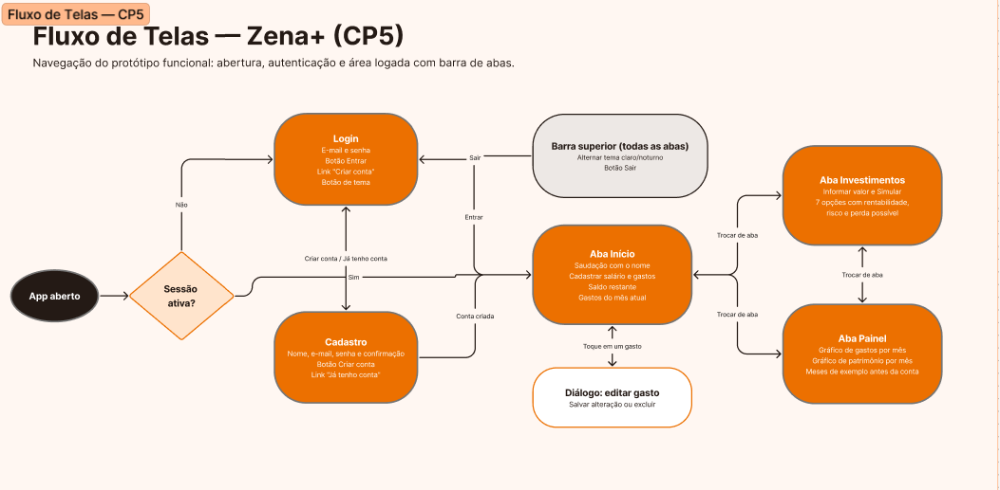
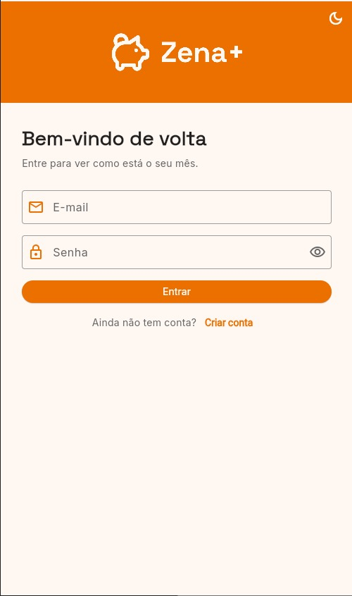
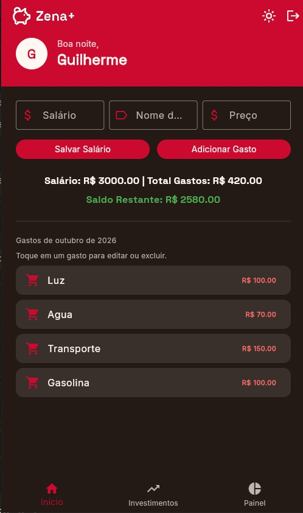
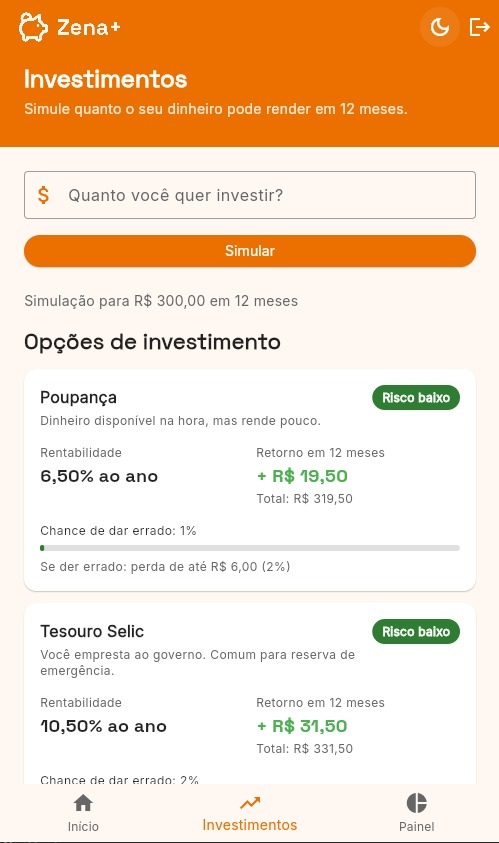
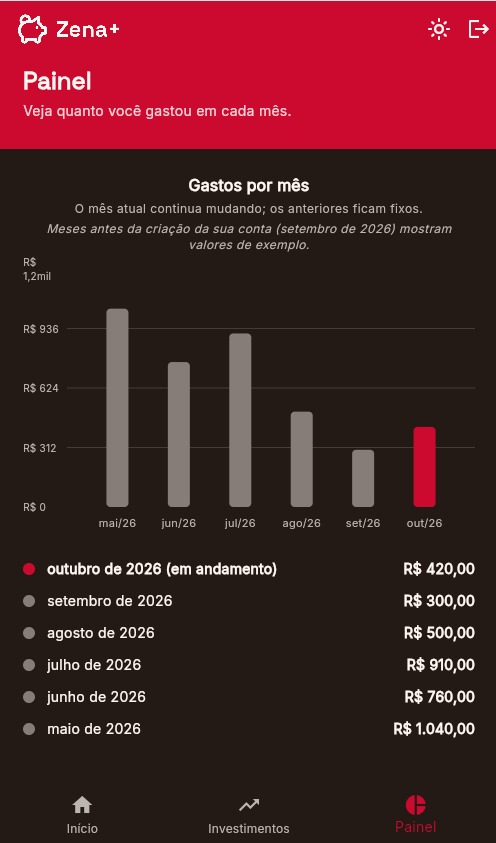
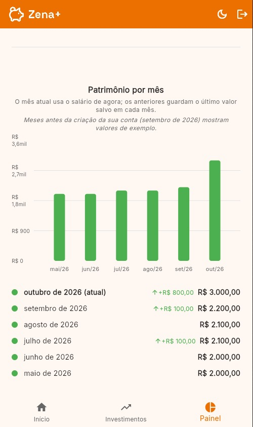

# Zena+

Organização financeira para a Geração Z.

Projeto integrado dos Checkpoints 4, 5 e 6 da disciplina **Desenvolvimento de Aplicações Multiplataforma** (FIAP · Ciência da Computação · 2º ano), com o Prof. Hercules Ramos.

| Checkpoint | Foco | Status |
| --- | --- | --- |
| CP4 | Idealização do app (marca, identidade visual, pitch, projeto inicial) | Concluído |
| CP5 | Protótipo funcional (telas navegáveis, dados mockados, ambiente de teste) | **Entrega atual** |
| CP6 | App final (MVP completo e APK instalável) | Próxima etapa |

## Vídeo de demonstração

[](https://youtu.be/jj5pYYHI2Lw)

▶️ **[Assistir no YouTube](https://youtu.be/jj5pYYHI2Lw)**

## Sumário

1. [Integrantes e papéis](#integrantes-e-papéis)
2. [Sobre o produto](#sobre-o-produto)
3. [Fluxo de telas](#fluxo-de-telas)
4. [Imagens do app](#imagens-do-app)
5. [Funcionalidades do protótipo](#funcionalidades-do-protótipo)
6. [Dados mockados](#dados-mockados)
7. [Como rodar o projeto](#como-rodar-o-projeto)
8. [Decisões técnicas](#decisões-técnicas)
9. [Banco de dados (Supabase, opcional)](#banco-de-dados-supabase-opcional)
10. [Estrutura de pastas](#estrutura-de-pastas)
11. [Testes automatizados](#testes-automatizados)
12. [Roadmap](#roadmap)
13. [Marca, identidade visual e pitch (CP4)](#marca-identidade-visual-e-pitch-cp4)

## Integrantes e papéis

| RM | Nome | Papel no projeto |
| --- | --- | --- |
| 563415 | Fernando Caires Silva | Pitch |
| 563500 | Guilherme Martins Rezende | Código |
| 563567 | Raphael Mischiatti de Souza | README e código |

## Sobre o produto

**Proposta de valor.** A visão do Zena+ é começar como o Pierre (CloudWalk): conectar a vida financeira do usuário e organizar tudo automaticamente, sem planilha e sem exigir que a pessoa vire "analista financeira de si mesma". A diferença é o horizonte: enquanto os apps de hoje param no controle do gasto do mês, o Zena+ ajuda a Geração Z a transformar a disciplina que ela já tem no dia a dia em decisões que constroem o futuro, como reserva, metas, patrimônio e aposentadoria. No CP5, o protótipo cobre a base desse caminho: controle manual de salário e gastos, histórico mensal e um primeiro simulador de investimentos.

**O problema.** Dados recentes mostram um contraste na nossa geração:

- Segundo o **Mapa da Inadimplência do Serasa (maio/2026)**, jovens de 18 a 25 anos representam apenas **11% dos inadimplentes do país**, a menor participação entre as faixas etárias (contra 33,3% na faixa 26-40 e 35,7% na faixa 41-60).
- Segundo o **Raio X do Investidor Brasileiro 2026** (Anbima + Datafolha), apenas **12% da Geração Z** já iniciou uma reserva para aposentadoria, embora **66%** pretendam começar no futuro.
- Um levantamento do setor (ClienteSA) aponta que **55%** da Geração Z se considera financeiramente organizada, o maior índice entre as gerações, mas **73%** sente que suas conquistas financeiras estão atrasadas, e **42%** diz que o dinheiro afeta diretamente a saúde mental.

Ou seja: somos a geração mais disciplinada no controle do dia a dia, mas sem estrutura para pensar em longo prazo.

**Público-alvo.** Jovens de aproximadamente 18 a 25 anos, universitários ou em início de carreira, que já usam banco digital e Pix, nunca investiram a longo prazo (ou não sabem por onde começar), não querem organizar dinheiro em planilha e valorizam marcas com linguagem direta, que não os tratem como "irresponsáveis".

## Fluxo de telas

O fluxo completo, com o que cada tela faz, está no board do projeto no Figma, logo abaixo do board inicial do CP4: [ver fluxo de telas no Figma](https://www.figma.com/board/SDKAwifTkTvITRMQaGuYjY/board-inicial-cp4?node-id=63-57).



1. Ao abrir, o app verifica se já existe uma sessão ativa: se sim, vai direto para a aba **Início**; se não, abre o **Login**. Quem ainda não tem conta vai para o **Cadastro**.
2. Depois de entrar, o usuário cai na aba **Início**, onde cadastra o salário e os gastos do mês.
3. Na aba **Investimentos**, informa um valor e compara quanto cada opção pode render em 12 meses.
4. Na aba **Painel**, acompanha os gastos e o patrimônio dos últimos 6 meses.
5. O botão de sair volta para o Login, e o botão de tema alterna entre claro e noturno em qualquer aba.

## Imagens do app

Prints do protótipo rodando, nos modos claro e noturno.

| Login | Início (modo noturno) |
| --- | --- |
|  |  |

| Investimentos | Painel: gastos por mês (modo noturno) | Painel: patrimônio por mês |
| --- | --- | --- |
|  |  |  |

Nos gráficos do Painel, a conta foi criada em setembro de 2026: os meses de maio a agosto mostram valores de exemplo, e setembro e outubro mostram os dados reais do usuário.

## Funcionalidades do protótipo

**Login e cadastro**
- Cadastro com nome, e-mail, senha e confirmação de senha, com validação dos campos.
- Login com e-mail e senha.
- O cadastro não exige confirmação por e-mail: a pessoa entra direto no app.
- Mensagens de erro em português (senha incorreta, e-mail já cadastrado, muitas tentativas etc.).

**Aba Início**
- Saudação no estilo dos apps de banco: "Bom dia / Boa tarde / Boa noite" + o primeiro nome do usuário.
- Cadastro do salário e dos gastos (nome + preço).
- Saldo restante calculado automaticamente (salário − gastos do mês).
- Lista dos gastos do mês atual. Tocando em um gasto, é possível editar ou excluir.
- No dia 1º de cada mês, a lista recomeça do zero. Os gastos antigos não são apagados: continuam guardados e aparecem no histórico do Painel.

**Aba Investimentos**
- O usuário informa quanto quer investir e toca em **Simular**.
- Sete opções, do menor para o maior risco, cada uma com rentabilidade anual, retorno em R$ em 12 meses, etiqueta de risco (baixo, médio ou alto), chance de dar errado e perda possível no pior cenário.

**Aba Painel**
- **Gastos por mês:** gráfico de colunas com o total gasto em cada um dos últimos 6 meses. A coluna do mês atual muda conforme gastos são adicionados, editados ou excluídos; os meses anteriores ficam fixos.
- **Patrimônio por mês:** gráfico de colunas com o salário de cada mês, mostrando aumento ou queda em relação ao mês anterior.

**Em todas as telas**
- Botão para alternar entre modo claro e modo noturno.
- Botão de sair da conta.

## Dados mockados

O protótipo foi pensado para ser demonstrado **sem depender de backend**. Os dados simulados estão em três lugares:

| O que é simulado | Onde está | Como foi pensado |
| --- | --- | --- |
| **Opções de investimento** | `lib/data/investimentos_mock.dart` | Sete produtos reais do mercado brasileiro (Poupança, Tesouro Selic, CDB, Fundos imobiliários, Fundo de crédito privado, Ações e Criptomoedas), cobrindo os três níveis de risco. Os valores seguem uma regra coerente: quanto maior o risco, maior a rentabilidade, a chance de dar errado e a perda possível. São números ilustrativos e não representam recomendação de investimento. |
| **Histórico dos gráficos** | `lib/data/historico_mock.dart` | Um valor de gastos e um de patrimônio para cada um dos 12 meses do ano. Os gastos variam entre R$ 500 e R$ 1.420, com picos em dezembro e janeiro; o patrimônio cresce aos poucos, de R$ 1.800 a R$ 2.300. Esses valores aparecem só nos meses **anteriores à criação da conta**, então todo usuário já vê um histórico desde o primeiro acesso, e o próprio gráfico avisa quais meses são de exemplo. |
| **Login e dados do usuário (modo de demonstração)** | `lib/services/mock_auth_service.dart` e `mock_financas_repository.dart` | Quando o Supabase não está configurado, o app usa automaticamente um login simulado (aceita qualquer e-mail válido e senha com 6 ou mais caracteres) e guarda salário e gastos em memória. Todo o fluxo funciona: cadastro, edição e exclusão de gastos, saldo e gráficos. Os dados somem ao fechar o app. |

Com o Supabase configurado, conta, salário e gastos passam a ser gravados em um banco real; os dois primeiros mocks continuam valendo. Veja [Banco de dados (Supabase, opcional)](#banco-de-dados-supabase-opcional).

## Como rodar o projeto

**Pré-requisitos**
- Flutter instalado (Dart 3.12 ou superior), com VS Code ou Android Studio.
- Um emulador Android configurado no Android Studio (ambiente usado na demonstração). O Google Chrome também funciona.

### Opção 1: modo de demonstração (recomendado para testar)

Não precisa de conta no Supabase.

**1. Baixar o projeto**
```bash
git clone https://github.com/Rezenderzd/cp_hercules.git
cd cp_hercules
```

**2. Criar um arquivo `.env` vazio na raiz do projeto** (na mesma pasta do `pubspec.yaml`). Ele precisa existir para o projeto compilar, mesmo vazio.
```bash
# Linux / macOS / Git Bash
touch .env

# Windows (PowerShell)
New-Item .env -ItemType File
```

**3. Instalar as dependências**
```bash
flutter pub get
```

**4. Abrir o emulador e rodar**

Abra o emulador pelo Android Studio (Device Manager → ▶) ou pelo terminal:
```bash
flutter emulators
flutter emulators --launch <id_do_emulador>
```
Com o emulador aberto:
```bash
flutter run
```
Para rodar no navegador: `flutter run -d chrome`.

**5. Entrar no app**

Use qualquer e-mail válido e uma senha com 6 ou mais caracteres (ex.: `teste@zena.com` / `123456`), ou crie uma conta na tela de cadastro.

### Opção 2: com o Supabase

Para gravar os dados em um banco real, preencha o `.env` com os dados de um projeto seu no Supabase (Project Settings → API Keys):

```
SUPABASE_URL=https://SEU-PROJECT-ID.supabase.co
SUPABASE_ANON_KEY=sb_publishable_xxxxxxxx
```

- Use apenas a chave **publishable** (pública). A chave secreta nunca vai no app.
- O `.env` está no `.gitignore` e não deve ir para o GitHub.
- O projeto precisa ter as tabelas descritas em [Banco de dados](#banco-de-dados-supabase-opcional). O grupo usou o próprio projeto Supabase durante o desenvolvimento.
- Em **Authentication → Sign In / Providers → Email**, deixe o provedor de e-mail **ligado** e o **Confirm email desligado**.
- Depois de editar o `.env`, reinicie o app com **hot restart** (tecla `R` maiúscula). O hot reload não recarrega o `.env`.

Se o Supabase não responder ou o `.env` estiver vazio, o app volta sozinho para o modo de demonstração.

### Testes
```bash
flutter test
```

### Problemas comuns
- *"The asset file '.env' doesn't exist"*: o arquivo `.env` não foi criado (passo 2).
- *"Building with plugins requires symlink support"* (Windows): ative o Modo de Desenvolvedor do Windows.
- *"Muitas tentativas"*: limite de requisições do Supabase. Espere alguns minutos ou aumente o limite em Authentication → Rate Limits.

## Decisões técnicas

**O que mudou do CP4 para o CP5**

| Aspecto | CP4 | CP5 |
| --- | --- | --- |
| Telas | Uma tela única | Login, cadastro e três abas: Início, Investimentos e Painel |
| Navegação | Nenhuma | Rotas nomeadas + barra de abas inferior |
| Conta do usuário | Não existia | Login e cadastro com e-mail e senha |
| Gastos | Só adicionar e listar | Adicionar, listar, editar e excluir, separados por mês |
| Salário | Um valor solto | Salvo com histórico mês a mês |
| Gráficos e investimentos | Não existiam | Painel com dois gráficos e simulador de investimentos |
| Identidade visual | Cores aplicadas, fonte padrão | Paleta e tipografia do CP4 aplicadas, com modo noturno |
| Código | Tudo em um único `main.dart` | Organizado em camadas (`core/`, `models/`, `services/`, `screens/`, `widgets/`) |

**Principais decisões**

- **Telas que não conhecem o banco.** As telas usam os contratos `AuthService` e `FinancasRepository`. O Supabase e o modo de demonstração são duas implementações desses contratos, escolhidas automaticamente na abertura do app. Trocar de banco não exige mudar nenhuma tela (inversão de dependência, o "D" do SOLID).
- **Supabase como backend opcional.** PostgreSQL relacional, autenticação pronta e segurança por usuário (RLS), o que encaixa com salário e gastos separados por pessoa.
- **Chaves no `.env` com `flutter_dotenv`**, como na Aula 18, para não deixar credenciais no código nem no GitHub.
- **Navegação por abas** com `BottomNavigationBar`, seguindo o Guia Prático "Do Figma ao Código Flutter".
- **Design system centralizado.** Cores e tipografia do CP4 em `core/theme/`, com `ThemeData` e `ThemeExtension` (Aula 17). O modo noturno troca o laranja pelo vermelho da paleta e o fundo creme pelo grafite.
- **Estado sem pacote extra.** A troca de tema usa `ChangeNotifier` + `ListenableBuilder`, nativos do Flutter.
- **"Reset" mensal sem apagar dados.** Os gastos não são excluídos no dia 1º: o app filtra pelo mês de criação, e o histórico do Painel continua completo.
- **Cadastro sem confirmação por e-mail**, por se tratar de um projeto acadêmico.
- **Erros visíveis na tela**, com mensagens que dizem o que fazer, e o erro técnico completo no console para depuração.

**Tecnologias:** Flutter e Dart · Supabase (`supabase_flutter`) · `flutter_dotenv` · `fl_chart` (gráficos) · `google_fonts` (Space Grotesk e Inter) · `flutter_test` e `flutter_lints` · Figma · Android Studio e VS Code · GitHub.

## Banco de dados (Supabase, opcional)

Usado apenas na [Opção 2](#opção-2-com-o-supabase) de execução. E-mail e senha ficam na tabela interna do Supabase Auth (`auth.users`), com a senha guardada como hash. As tabelas do app são:

| Tabela | Colunas | Para que serve |
| --- | --- | --- |
| `profiles` | `id`, `nome`, `salario`, `created_at` | Um registro por usuário, com o nome e o salário atual. |
| `gastos` | `id`, `user_id`, `nome`, `preco`, `created_at` | Cada gasto do usuário. A data `created_at` define em qual mês ele entra. |
| `salarios_mensais` | `id`, `user_id`, `mes`, `valor`, `atualizado_em` | Histórico do salário, um registro por usuário por mês (chave única em `user_id` + `mes`). Salvar de novo no mesmo mês atualiza o registro em vez de duplicar. |

Todas as tabelas usam **RLS** (Row Level Security): cada usuário só enxerga e altera os próprios dados.

## Estrutura de pastas

```
cp_hercules/
├── assets/                       logo usado dentro do app
├── imagens/                      imagens do README
│   └── cp5/                      prints do app e do fluxo de telas
├── lib/
│   ├── main.dart                 carrega o .env, escolhe Supabase ou modo de demonstração e abre o app
│   ├── app.dart                  MaterialApp, temas e rotas
│   ├── env.dart                  leitura das chaves do .env
│   ├── core/
│   │   ├── routes.dart           nomes das rotas
│   │   ├── theme/                cores, tipografia, tema claro/noturno
│   │   └── utils/                validações, moeda, saudação, cálculos por mês
│   ├── data/
│   │   ├── investimentos_mock.dart   opções de investimento (mockadas)
│   │   └── historico_mock.dart       meses antes da criação da conta nos gráficos (mockados)
│   ├── models/                   Gasto, Investimento, SalarioMensal
│   ├── services/                 contratos e implementações (Supabase e modo de demonstração)
│   ├── screens/
│   │   ├── login/                login e cadastro
│   │   ├── main/                 tela com a barra de abas
│   │   ├── home/                 aba Início
│   │   ├── investimentos/        aba Investimentos
│   │   └── dashboard/            aba Painel
│   └── widgets/                  componentes reutilizáveis (botões, campos, cards, gráficos)
├── test/                         testes automatizados
├── pubspec.yaml                  dependências do projeto
└── .env                          chaves do Supabase (só na sua máquina, fora do Git)
```

## Testes automatizados

Os testes em `test/` cobrem as regras de negócio sem precisar abrir o app: validação dos formulários, saudação e nome, agrupamento de gastos por mês (incluindo a virada do ano), histórico de salário, valores de exemplo dos gráficos, cálculos dos investimentos e os fluxos das telas (login, cadastro, abas, edição de gastos e modo noturno). Para rodar: `flutter test`.

## Roadmap

| Etapa | Situação |
| --- | --- |
| Ícone do app no launcher Android e geração do APK | CP6 |
| Conexão via Open Finance (importar contas e cartões automaticamente) | Planejado. No CP5 os gastos ainda são cadastrados manualmente. |
| Categorização automática de gastos | Planejado |
| Alertas inteligentes (assinaturas esquecidas, gasto fora do padrão) | Planejado |
| Metas de reserva e objetivos de longo prazo | Planejado |
| Simulação "eu no futuro" | Primeiro passo no CP5: simulador de investimentos e histórico de patrimônio no Painel |

> Este roadmap é revisado a cada Checkpoint conforme o grupo decide o que entra no MVP do CP6.

## Marca, identidade visual e pitch (CP4)

Conteúdo definido no CP4 e mantido como referência. Clique para expandir.

<details>
<summary><b>Marca</b></summary>

- **Nome:** Zena+ mantém o "Z" como referência direta à Geração Z, e o "+" reforça a proposta central da marca: depois de organizar o básico, sempre tem um próximo passo (guardar, investir, crescer). O nome soa como um nome próprio curto, no mesmo espírito humanizado da concorrência, o que facilita um tom de voz mais pessoal e menos corporativo.
- **Tom de voz:** direto, acolhedor, confiável, motivador (sem julgamento sobre erros passados).
- Exemplos de uso:
  - "Notamos R$ 90 em assinaturas que você não usa há 2 meses. Quer revisar?"
  - "Faltam R$ 340 pra você bater sua meta de reserva do mês. Ainda dá tempo."

</details>

<details>
<summary><b>Identidade visual</b></summary>

- **Paleta:** laranja Itaú (`#EC7000`) como cor primária + vermelho Bradesco (`#CC092F`) como acento, com neutros quentes (`#241A15` / `#FFF7F2`).
- **Tipografia:** Space Grotesk (títulos e números em destaque) + Inter (interface, tabelas, corpo), via pacote `google_fonts`.
- **Logo:** ícone de porquinho (cofrinho) + wordmark "Zena+":
  - `zena-logo-dark-bg.png`: porquinho e wordmark em creme, para fundos laranja/escuros (usado no cabeçalho do app).
  - `zena-logo-light-bg.png`: porquinho em laranja e wordmark em grafite, para fundos claros.
  - `zena-logo-icon.png`: ícone quadrado com fundo laranja, para o launcher do app (será aplicado no CP6).
- Board de ideias completo: [ver no Figma](https://www.figma.com/board/SDKAwifTkTvITRMQaGuYjY).

| Logo para fundo escuro | Logo para fundo claro | Ícone do app |
| --- | --- | --- |
|  |  |  |


</details>

<details>
<summary><b>Pitch: por que o Zena+ existiria no mercado</b></summary>

**Diferencial competitivo:** o Pierre e os apps de organização financeira param no controle do gasto do mês. Apps tradicionais de planilha (Mobills, Organizze) exigem esforço manual de categorização. O Zena+ ocupa o espaço entre os dois: a mesma simplicidade de uso do Pierre, mas com o olhar de longo prazo que nenhum dos dois oferece hoje, construído por quem já trabalha dentro do mercado financeiro e conhece as dores reais desse público.

**Modelo de negócio (proposto):**
- **Freemium:** organização básica (cadastro manual, depois conexão via Open Finance, alertas simples) gratuita.
- **Assinatura premium:** funcionalidades avançadas (simulação de aposentadoria, metas múltiplas, relatórios aprofundados).
- **Parcerias financeiras (fase futura):** comissionamento por indicação de produtos de investimento/reserva dentro do app, aproveitando a experiência do grupo no setor bancário para validar parceiros confiáveis.

</details>
